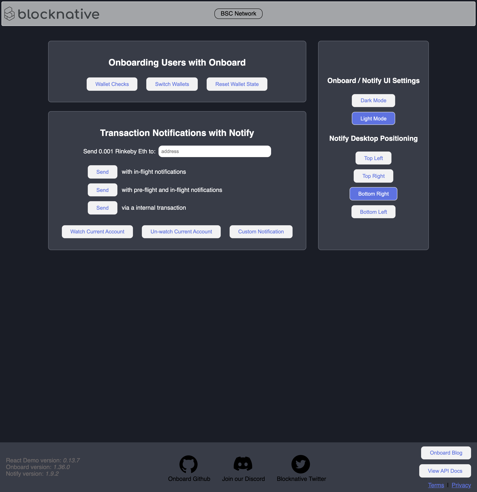

# React Demo

A repository to demonstrate a basic integration of 
[Web3-Onboard](https://github.com/blocknative/web3-onboard) 
and [Notify](https://github.com/blocknative/notify) into a React project.
For detailed documentation, head to [docs.blocknative.com](https://docs.blocknative.com)


<div align="center">
  
</div>

View live demo [here](https://reactdemo.blocknative.com/)!

## Getting started

Clone the repo:

```bash
git clone https://github.com/blocknative/react-demo.git
```

Navigate to the project directory:

```bash
cd react-demo
```

Install the dependencies:

```bash
yarn
```

Start the development server:

```bash
yarn start
```

The project will be running on [localhost:3000](http://localhost:3000)

### SSL
Some wallets require that the website within which it runs be using a https 
connection. If you are testing one of these wallets, Ledger is one, then you have
two options:
 1. Setup a valid certificate for localhost using [this guide](https://www.freecodecamp.org/news/how-to-set-up-https-locally-with-create-react-app/).
 2. Allow invalid certificates for resources loaded from localhost by navigating here within a chrome based browser: [chrome://flags/#allow-insecure-localhost](chrome://flags/#allow-insecure-localhost)
